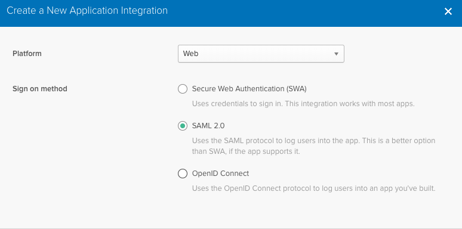
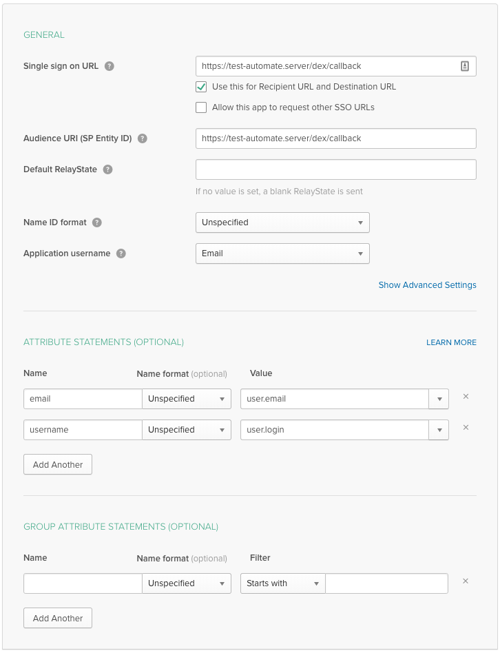
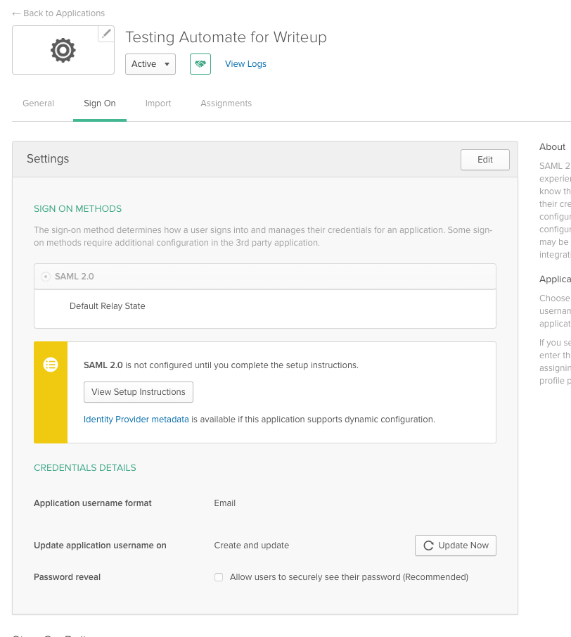
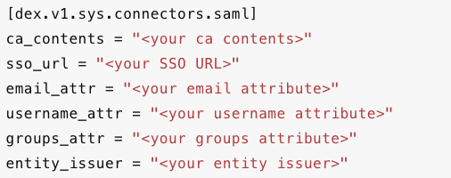

# HowTo - Setting up SAML Auth in A2 with Okta

**IMPORTANT NOTE**: As of September 15, 2021, idp-initiated SAML logins do not work from any idp/browser to Automate 2.
- Follow https://chef-software.ideas.aha.io/ideas/AUTO-I-59 for updates, to see if this has changed.

#### Before You Start
##### Assumptions
- This guide assumes you have the following set up:
    - An Okta Instance
        - Admin Rights to the Instance
    - Chef Automate 2.0

##### Versions Tested On
- Chef Automate | [2.x]

#### Creating the App in Okta:
1. Log in to Okta as an admin (you will not be able to add an app without admin access to Okta)

2. From your dashboard, click "Add applications" then click "Create New App"

3. In the dialog box for "Create a New Application Integration", ensure platform equals Web and you select the SAML 2.0 radio button. Then click create

4. Fill in the name of your app and add a logo on the next screen, then click next

5. On the SAML settings screen, use the following settings in the form then click next:
    - *Single sign on URL*: This should be the URL for your automate server plus /dex/callback. Example: https://your-automate.server/dex/callback
    - *Audience URI*: This will be the same URL as Single sign on URL
    - *Default RelayState* should be blank
    - *Name ID Format* should be Unspecified
    - *Application Username* should be Email
    - Under *attributes* you'll want to create two:
        - *Name*: email  *Value*: user.email
        - *Name*: username    *Value*: user.login

*_For Information on Group Attribute Statements, refer to the Automate 2.0 documentation_*

6. For the final okta page, you'll select "I'm an Okta Customer adding an internal app". The rest of the information on this page is optional. When you're finished, click finish.

7. You will now be taken to an application overview page. Click "View Setup Instructions" under sign on methods.

8. Keep the Setup Instructions open for use in your config on the A2 server

#### Setting up SAML on the A2 server:
1. ssh to your A2 instance
2. create a file called `saml.toml` where we will put in configuration information
3. In the saml.toml file, you will need to add the following information in the example format listed in the image below:
    - *ca_contents*: this is the X.509 Certificate on the Setup Instructions page. Copy this and paste as the value for ca_contents. Use three double quotes to indicate a multiline string. (ex: `"""`)
    - *sso_url*: This is the value for Identity Provider Single Sign-On URL listed on the Setup Instructions page in Okta
    - *email_attr*: The value for this should be email
    - *username_attr*: The value for this should be username
    - *entity_issuer*: This should be the URL for your automate server plus /dex/callback. Example: https://your-automate.server/dex/callback

4. Save and close the file

5. Now, run `sudo ./chef-automate config patch saml.toml`. You should get a success message that looks like the message below:

6. Navigate to your A2 instance in your browser and select the Log in with SAML option.

#### FAQs
1. Clicking the tile in Okta is not currently supported. You will have to navigate in browser to your A2 instance as before.

2. Full setup documentation can be found at https://automate.chef.io/docs/configuration/
