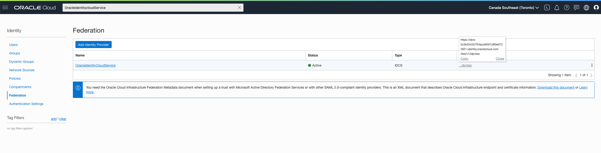
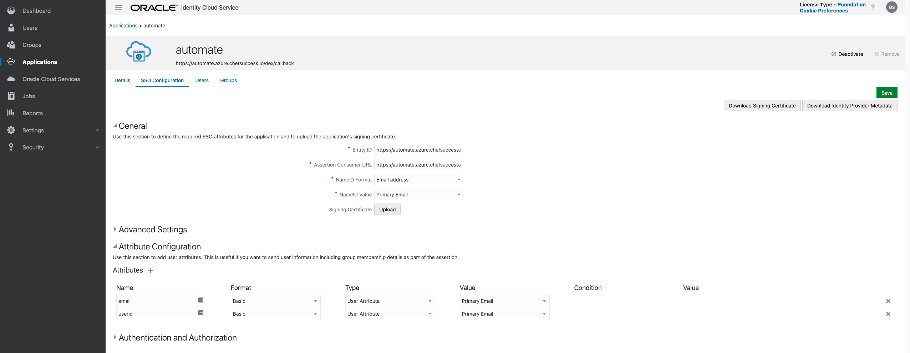

# HowTo - Setting up SAML Auth in A2 with Oracle Identity Cloud Service

#### Before You Start
##### Assumptions
- This guide assumes you have the following set up:
    - Oracle Identity Cloud Service
        - Admin Rights to the Applications Section
    - Chef Automate 2.0

##### Versions Tested On
- Chef Automate | [2.x]

#### Creating the App in Oracle Identity Cloud Service

1. Log in to Oracle Cloud console

2. Open the hamburger menu on the left hand side. Click on "Identity and Security" and then click on "Federation".

3. In the list of identity providers, locate "OracleIdentityCloudService".
    - Copy the Redirect Url for later.



4. Click on the "OracleIdentityCloudService" hyperlink.

5. Click on the Url displayed for "Oracle Identity Cloud Service Console"

6. In the hamburger menu, click on "Applications" and then "Add".
    - Provide a name for the application on the details page

7. Click on "SSO Configuration"
    - Enter https://your-automate.server/dex/callback as the "Entity ID"
    - Enter https://your-automate.server/dex/callback as the "Assertion Consumer URL"
    - Set the "NameID Format" to "Email address".
    - Set the "NameID Value" to "Primary Email"
    - Expand the Advanced section and make sure "Enable Single Logout" is not checked.
    - Under **Attribute Configuration** add two new attributes
      - email: Primary Email
      - username: Primary Email



8. Click "Save".

9. Click on "Download Signing Certificate".
    - Keep this file somewhere safe

10. Click on "Activate" to activate the application.

11. Click on "Users"
    - Add users who should be able to access Automate

#### Setting up SAML on the A2 server:
1. `ssh` into your A2 instance
2. Create a file called `saml.toml` where we will put in configuration information
3. In the saml.toml file, you will need to add the following information:
    - **ca_contents**: this is the X.509 Certificate you downloaded in step 9 above. Copy this and paste as the value for ca_contents. Use three double quotes to indicate a multiline string. (ex: `"""`)
    - **sso_url**: This is the value for the Oracle Identity Cloud Service Redirect Url copied in set 3 from the cloud console.
    - **email_attr**: The value for this should be email
    - **username_attr**: The value for this should be username
    - **entity_issuer**: This should be the URL for your automate server plus /dex/callback. Example: https://your-automate.server/dex/callback
    - **name_id_policy_format**: This should be set to "urn:oasis:names:tc:SAML:1.1:nameid-format:emailAddress"

4. Save and close the file

```
[dex.v1.sys.connectors.saml]
ca_contents="""-----BEGIN CERTIFICATE-----
...
-----END CERTIFICATE-----
"""
sso_url = "https://your-idcs-url.identity.oraclecloud.com/fed/v1/idp/sso"
email_attr = "email"
username_attr = "userid"
entity_issuer = "https://your-automate.server/dex/callback"
name_id_policy_format = "urn:oasis:names:tc:SAML:1.1:nameid-format:emailAddress"
```

5. Now, run `sudo ./chef-automate config patch saml.toml`. You should get a success message that looks like the message below:

```
Setting deployment configuration

Applying deployment configuration
  Started automate-dex
Success: Configuration set
```

6. Navigate to your A2 instance in your browser and select the Log in with SAML option.

7. Log in with a user who has been granted access to the application through Oracle Identity Cloud Service.
