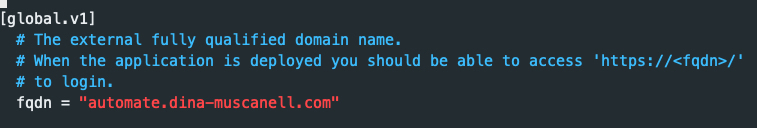
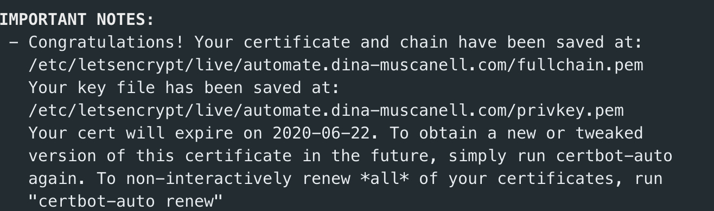
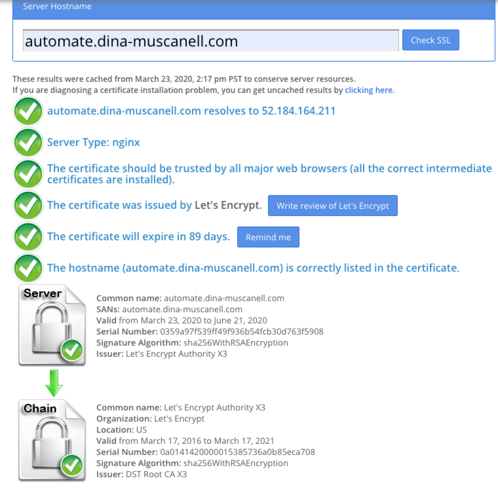
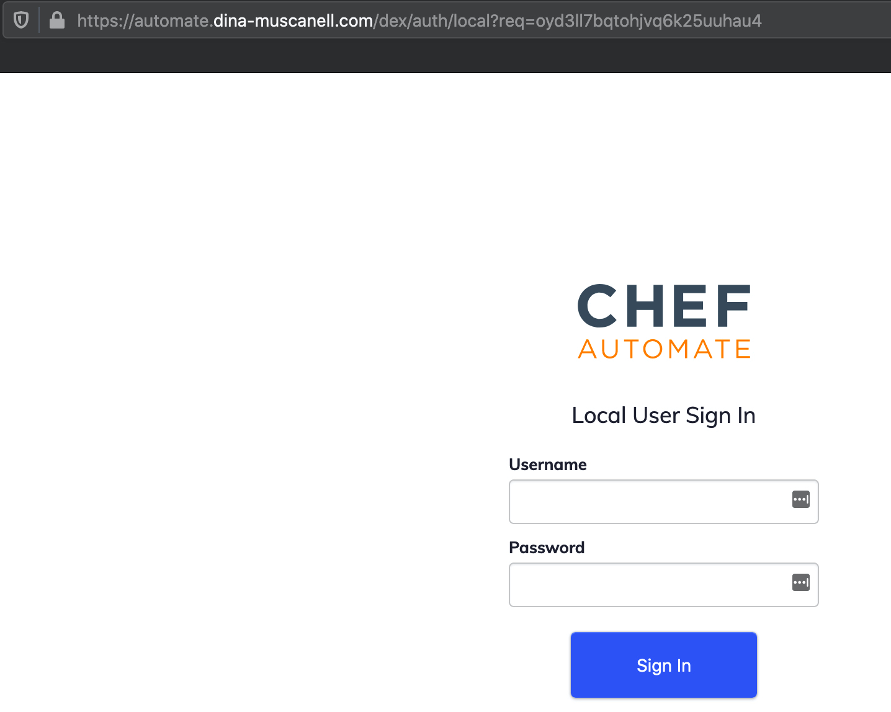

# HowTo - Create and Set up an SSL cert on Chef Automate using Certbot (includes Lets Encrypt) with a subdomain

This guide will walk you through creating an SSL cert with Lets Encrypt then applying it to Chef Automate. The end result should be hitting the Chef Automate front end without a cert warning from the web browser.

## Before You Start

### Assumptions

#### Chef Automate is installed

- Automate is installed on an Ubuntu server [to install automate follow the directions here](https://automate.chef.io/docs/install/)
  - Note:
    - The inbound `80` and `443` ports should be open, these may need to be added to the networking rules if the front end is unreachable after following the installation steps.
- The Automate server has a public IP, which you can hit from a web browser (with a cert warning) and successfully login.
- You can ssh into the server and have permission to run sudo commands

#### A subdomain is setup

- You own a domain name (ex: `your-name.com`) and have a domain provider (such as Netlify, GoDaddy, etc.)
- You've set a CNAME record from your subdomain to your domain (ex: `automate.your-name.com` points to the value `your-name.com`)
- You've set an A record from your subdomain to the public IP (ex: `automate.your-name.com` points to `34.210.219.228`)

At this point, if you can hit the public IP in a web browser and login with the credentials found in `automate-credentials.toml` you are **good to proceed.**

Note: you will get a cert warning, that is ok, follow these instructions to fix it.  You may need to use firefox or edge to login without the SSL cert, (chrome may block any non-ssl sites based on preferences).

#### Versions Tested

- Chef Automate `Version 2` (specifically CLI build `20200310163010` and server build `20200310163217`, I believe these steps should work for most versions though)
- Ubuntu `18.04`
- Certbot `1.3.0`

## How to install a Lets Encrypt SSL Cert for a subdomain

### Back up the config.toml

- I strongly suggest backing up the `config.toml` located in the users home folder before starting and multiple times when going through this process.

The file can be backed up by running: `cp config.toml config.toml.backup`

### Ensure subdomain points to Automate

- Update the `config.toml`, in the `fqdn` to point to your subdomain. (following our example from above, the new fqdn would be `automate.your-name.com`).

- 

- Run `chef-automate config patch </path/to/your-config-file.toml>`

You should now be able to hit your `automate.your-name.com` address and receive a warning showing the certificate is not valid for the address.  Again, that is okay at this point, the next steps will fix that.

### Install Certbot (includes lets encrypt)

Run the following commands while logged in via SSH to the chef automate server:

- `apt-get update`
- `apt-get install python-minimal` then verify by running `python --version`
- `apt-get install git-core` then verify by running `git --version`
- `cd /opt`
- `git clone https://github.com/certbot/certbot.git`

### Generating the SSL cert

Run the following commands while logged in via SSH to the chef automate server:

- `cd certbot && ./certbot-auto`, accept the prompt regarding the amount of disk space required
- Then run the following, ensuring the -d argument passes the **subdomain you want** to the automate server to point to:

``` bash
  ./certbot-auto certonly \
  --manual \
  --preferred-challenges=dns \
  --email <YOUR-EMAIL> \
  --server https://acme-v02.api.letsencrypt.org/directory \
  --agree-tos \
  -d automate.your-name.com
```

- Answer prompts accordingly...
- Create a txt record back on your domain service.  The name should be the `_acme_challenge.<your-subdomain>` and the value should be the `key` provided.
- Once verified, take note of where the `fullchain.pem` and the `privkey.pem` are saved.  Typically to `etc/letsencrypt/live/<your sub domain>`

- 
- Take note for **when the cert expires** and for future renewals, you can just run `certbot-auto renew`

### Updating the config.toml

- Now that the certs have been generated, they need to be updated in the `config.toml`.  Again, if you haven't done so yet, I would backup the `config.toml`

- The `config.toml` has two places that need to be updated, first the `cert = """ the original cert value"""` where `original cert value` should be replaced with _the entire_ `fullchain.pem`.  This will be longer than the current value, it is okay. The `cert =` followed by the three quotes and ending with the three quotes should still be present after the updates.  Only the value inside the three quotes should be updated.

- Next replace, the `key = """ original key value """` where `original key value` should be replaced with the `privkey.pem` value.  The `key =` followed by the three quotes and ending with the three quotes should still be present after the updates.  Only the value inside the three quotes should be updated.

- **Ensure** syntax highlighting is still available on the `config.toml` after the updates or there is an issue in the file after making the updates.

- Then use the patch command `chef-automate config patch </path/to/your-config-file.toml>`

### Verifying the SSL cert

- Use the SSL cert checker [here](https://www.sslshopper.com/ssl-checker.html) to ensure all green check marks are returned for the cert.

- 

- If you are still receiving cert warnings after the cert check returns all green check marks, the site is cached.  Use an incognito window, or clear the cache.

- If not all of the chain has been verified, please re-check the above steps.  If you are making additional changes, please note you may need to run `chef-automate config set </path/to/your-config-file.toml>`

- Finally, you should be able to hit the chef automate front end without cert warnings and the lock!

- 