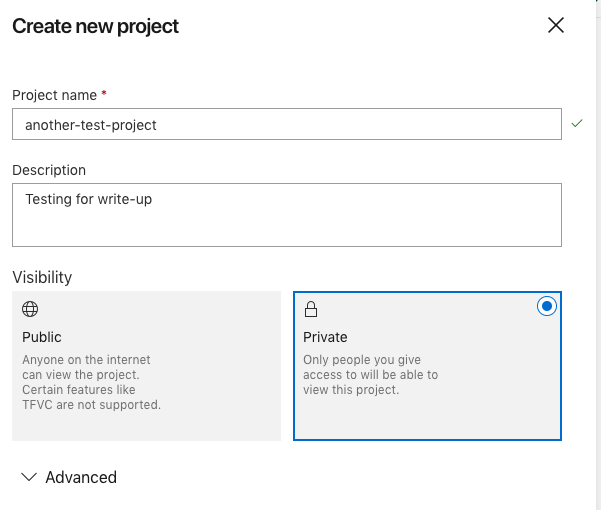
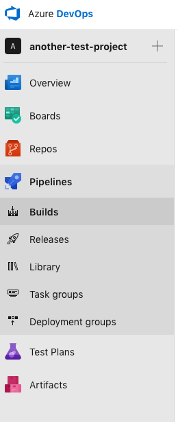
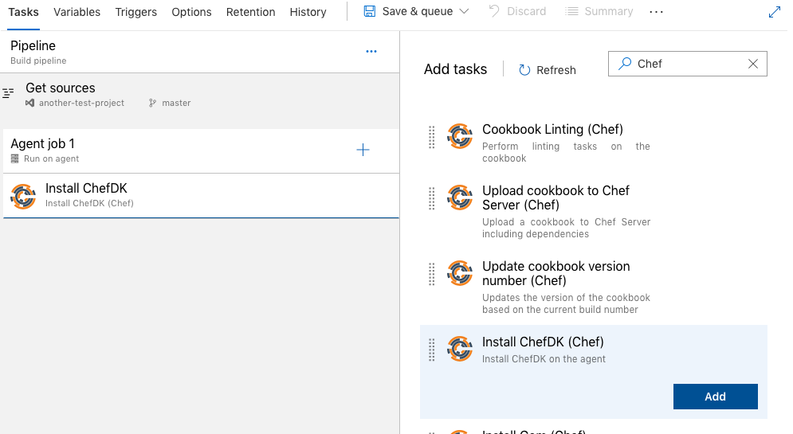

# HowTo - Creating a Cookbook Pipeline Using Azure DevOps

#### Before You Start
##### Assumptions
- This guide assumes you have the following set up:
    - Source Control (ie. Azure DevOps, Github, Gitlab, Bitbucket, etc)
    - A working instance of Azure DevOps
        - Admin rights to your Azure DevOps instance
    - Chef Server

##### Versions Tested On
- Chef Automate | [2.x]
- Chef Server | [12.x]

#### Creating Your Cookbook Pipeline

1. In your Azure DevOps Instance, click "Create Project"

2. Once your project has been created, on the left side click builds in the pipeline menu, then click "New Pipeline" on the right. 

3. In the New pipeline view, on the right under "Where is your code", click the "Use the visual designer" link. 

4. Select the location of your code as a source and set the default branh for scheduled builds, then click continue. 

5. On the top right, choose empty job when you get to the template screen.

6. On your pipeline screen, first update your agent pool to use whatever OS you intend to test with. Then in the "Agent Job 1" box, you'll click the plus sign to the right of the box. 

7. From here, in the "Add tasks" menu on the right, click Marketplace, then in the search box you'll type Chef. When Chef Integration shows up, click "Get it free". You'll be redirected to another screen where you will again click "Get it free", then you're prompted to select an Azure DevOps Organization where you would like to install it. After making your selection, click install. 
    - Once it's finished installing, you'll click "Proceed to organization". 

8. When you get back to the main Azure DevOps page for your organization, click your project, then click pipelines again on the left. You'll need to go through the steps we went through previously again (ie. Click build, create a new pipeline, click visual designer, etc). 

9. Back in the add tasks menu, search Chef. You will notice that a bunch of Chef tasks come up this time. The first one you want to add is going to be "Install ChefDK". 

10. From here, you can add other tasks as well. * Many of the testing tasks like cookbook linting use rake. If you do not have a rakefile, and you do not want to create/use one you can simply use the script task and give it a chefdk command like `foodcritic .`. * If you take this option, make sure to give the full path to the executable. 

11. Once you are staisfied with your steps, and if you want this pipeline to auto execute, click triggers and enable continuous integration. 

