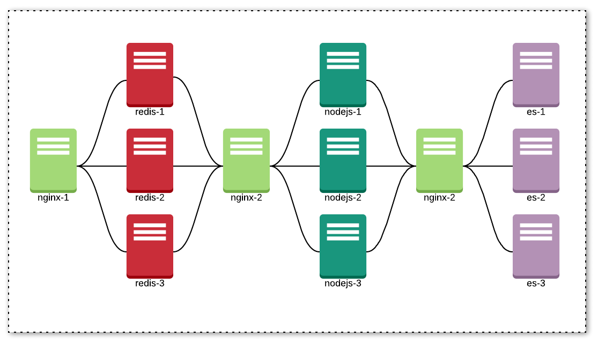
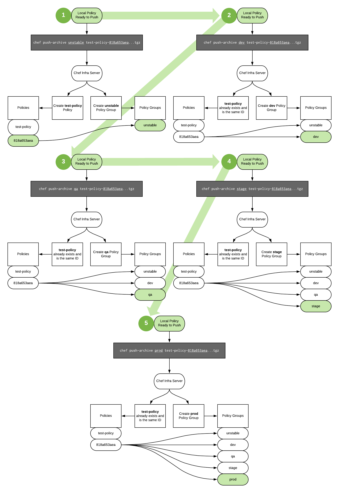

# The Comprehensive Policyfile Workflow Guide

As the Chef Standard for Policyfile usage, this guide aims to provide a single, 
opinionated standard for:

* Defining policies and policy groups.
* Creating and publishing a base policy.
* Creating and publishing role-level policies.
* Making changes at base-policy level and pushing those changes out (rebuild the
world).

## Contents

* [Goals](#goals)
* [Before You Start: Assumptions](#assumptions)
* [Before You Start: Tested Versions](#tested-versions)
* [Step 1: Define Policies](#step-1-define-policies)
* [Step 2: Define Policy Groups](#step-2-define-policy-groups)
* [Step 3: Create a Base Policy](#step-3-create-a-base-policy)
* [Step 4: Create a Deployable Policy](#step-4-create-a-deployable-policy)
* [Step 5: Bootstrap Nodes](#step-5-bootstrap-nodes)
* [Step 6: Make Changes to a Deployable Policy](#step-6-make-changes-to-a-deployable-policy)
* [Step 7: Make an Upstream (Base Policy) Change and then Update and Push Downstream (Deployable Policies)](#step-7-make-an-upstream-(base-policy)-change-and-then-update-and-push-downstream-(deployable-policies))
* [Links](#links)
* [Appendix: Attributes](#attributes)
* [Appendix: Policy "Pushing"](#policy-pushing)
* [FAQ's](#faqs)

## GOALS

* Provide a single, stable, and sane pathway for change in your environment.
* Make it easy for the application owner to make changes to their fleet as fast
as they want, without the risk of inadvertantly affecting others.
* Reduce the blast radius of a traditional Chef Infra deployment.
* Get rid of Environments and Roles.
* Define attributes that live with the policy instead of an environment or
role `json` file.
* Help your teammates fall in love with configuration management :).

## Before You Start

### Assumptions

* You have an understanding of Policyfiles, if you haven't already, head over
to [learn.chef.io](https://learn.chef.io), and sign up for the [Manage Your Fleet with Chef Infra](https://learn.chef.io/courses/course-v1:chef+Infra101+perpetual/about) course. Under the "Expand your Chef Infra language skills" section, complete the 
"Learn more about Policyfiles", followed by "Managing a Node With Policyfiles".
* You are using SCM that has the ability to fire webhooks, and a Job server that
has the ability to trigger based on them. I use Jenkins because I'm jumping 
between different cloud providers a lot and it's flexible enough to use in my
home-lab as well.
* You have Chef Infra and Automate setup and available.
* You have an open mind, follow all of the steps in this guide thoroughly and 
ask questions! If you have Success Slack, you can reach me with handle @dbright,
in Chef Community Slack, I'm @dbright as well, and finally - if all else fails -
dbright@chef.io.

### Tested Versions

* **Chef Infra Client** | [`>= 15`]
* **Chef Infra Server** | [`>= 13`]
* **Chef Automate** | [`>= 2020*`]

## Step 1: Define Policies

### **Note: all of the example code can be found here**

Before we do anything else, we're going to take a look at our own infrastructure
from a 10,000 ft view. This is best done on a whiteboard with fellow Chef's, but
I'll be using some diagrams to illustrate the process.

1. Draw out your infrastructure on a whiteboard, start with something you know
well and feel like you can work with the easiest, here's an example of an API
app and it's supporting infrastructure, this imaginary app is called Ymir - and
it serves API requests about Norse mythology:

    
1. Find and circle the "Widest areas of uniqueness":
    
    
1. Notice in the image above, I've circled 4 unique groups of nodes. These will 
be our Policies. Let's go ahead and define them as follows:
   1. `ymir-lb`
   1. `ymir-cache`
   1. `ymir-api`
   1. `ymir-backend`
1. That's it! I haven't touched any code yet, but I've already defined my first
four Policies. Next, let's take a look at Policy Groups.

## Step 2: Define Policy Groups
Policy Groups can be thought of as arbitrary tags that exist to do **ONE** 
thing - **reference a specific Policy ID**. That's really all they do, and when
a Policy Group is referenced alongside a Policy from a client, when that client
talks to the Chef Infra Server, it knows exactly what Policy and revision to
pull down and apply. Here were going to start defining them.

1. OK, so we've defined our Policy names in Step 1, now let's define our Policy
Groups. To do this, we're going to need to know the following:
   * How many environments does Ymir exist in?
   * Are there any special considerations to take into account when making
   changes to Ymir? For example, can I simply update all of my Redis nodes at 
   one time, or do I need to do that in a specific order?
   * Is there a standard deployment practice that must be adhered to? Such as a
   requirement to perform Blue/Green or Canary type deployments?
1. For the sake of this guide, I'm going to answer the above questions as 
follows:
   * Ymir lives in 4 environments:
     * `dev-sandbox`: a minimal environment that uses just enough nodes of each
     Policy type to actually function, no clustering etc... This environment
     typically allows for changes to be made to it on an ongoing basis without
     the need for large scale coordination, simple Slack messages suffice.
     * `dev`: a minimal environment that involves clustering and a bit more
     coordination than the previous environment. Typically once code is baked
     here for a few days and seems stable, it is released to the next
     environment.
     * `qa`: the closest replica to the production environment, typically this
     environment is tested and scrutinized by automated processes and humans who
     validate that Ymir is healthy and is ready to be deployed to the final 
     stage.
     * `prod`: this is the full fledged environment where Ymir actually serves 
     customer API requests. 
   * Special considerations:
     * Redis must be updated/changed/patched in a rolling manner, with one node
     removed from service, changes made, and then put back into service and 
     verified before moving on to the next one.
     * Elasticsearch also requires changes to be made in a rolling manner.
   * These are the standard deployment practices: 
     * The `prod` environment has deployment controlled by a number of factors: 
     it must pass qa testing.
     * It needs approval by a change board. 
     * Requires a deployment and rollback plan before changes can be made. 
     * Also, for our purposes, the api nodes (nodejs) are deployed in a Blue/
     Green deployment manner.
1. Now we have a basis for defining our policy groups. I'll go ahead and define
them as follows, and then explain why:
    * `dev-sandbox`
    * `dev-group-1`
    * `dev-group-2`
    * `dev-group-3`
    * `qa-group-1`
    * `qa-group-2`
    * `qa-group-3`
    * `qa-blue`
    * `qa-green`
    * `prod-group-1`
    * `prod-group-2`
    * `prod-group-3`
    * `prod-blue`
    * `prod-green`
1. Explanation:
    * `dev-sandbox`: self-explanatory, you can make changes to this environment 
    without the need for coordination. 
    * `dev|qa|prod-group-*`: because we have nodes that need to be updated in a 
    rolling fashion, we split them up into groups so we can progress through
    them.
    * `qa|prod-blue|green`: our API nodes will be put into either one of these
    groups, in order to be changed using the blue/green deployment method.
1. Alright! We've defined our Polices + Policy Groups, obviously this will look
different from our fictional app Ymir based on how you do things in your own
environments. The point is that before embarking on the Chef journey, it's 
imperative to have a good understanding of your application and how it 
should (ideally) be deployed. I've seen this take days and weeks to even get a 
concensus with some teams, because a lot of times it involves pulling multiple 
groups together to really gain a better understanding of how the whole thing 
works.

## Step 3: Create a Base Policy
OK, let's create our first policy, the "base" policy. The **base policy** is 
typically a policy that includes the following:

* **Common Agents** - that exist across your fleet. Typically 
these are things like the Chef Infra Client (of course ;)), logging, monitoring
and antivirus software.
* **OS Configuration** - this usually includes things like authentication 
configuration, security policies, O/S level settings, MOTD, etc...
* **Compliance Policy & Remediation** - depending on what standards your 
organization adheres to, this involves 2 things, detection & remediation. The
idea is to apply a base-level policy that should be in effect for your entire
fleet, and base-level remediations as well. Any other policies/remediations on
top of the base level should be part of the deployable policy you configure your
nodes to use.

For the purposes of this excercise, I'm going to create a local folder structure
so it's easier to follow along. This isn't necessary, but I highly recommend
putting some thought into your local workspace and especially things like 
naming schema (prefix/suffix, use -'s or _'s, etc...) and folder structure 
before proceeding.

This is what my local workspace directory structure looks like, **before step 1
create a structure of your own**:

```
.
├── base-policies
│   ├── base-linux
│   └── base-windows
└── ymir-policies
    ├── api
    ├── backend
    ├── cache
    └── lb
```

Notice `base-policies` and `ymir-policies` are separate, this is really more
for clarification when working on policies locally, each subdirectory actually
refers to a single repo in SCM, which we'll talk about later, for now, we're 
going to do everything locally, later we'll tie it together with SCM and 
automation.

In the following guide, I will walk through creating a base policy for Linux, 
this will be pretty simplistic and will follow CIS Level 1 standards. I'll be
using Centos 7 as my OS.

We're going to use the concept of an "attributes cookbook" during this 
excercise, so the cookbook that was generated will be used as the attributes
cookbook. We're also going to be using [Effortless Audit](https://github.com/chef/effortless)
combined with the [Habitat Cookbook](https://github.com/chef-cookbooks/habitat)
to deploy and run compliance profiles.

1. This is what my local workspace directory structure looks like, go ahead and
create a structure of your own:
    ```
    .
    ├── base-policies
    │   ├── base-linux
    │   └── base-windows
    └── ymir-policies
        ├── api
        ├── backend
        ├── cache
        └── lb
    ```
1. After you've created your directory structure to suit your needs, create the
`base-linux` Policyfile "cookbook" by entering:
    ```
    chef generate cookbook base-linux
    ```
    This will generate a Policyfile cookbook (which is really just a cookbook
    that has a `Policyfile.rb` in the root directory) and pre-populate it with
    the name.
1. Create an Effortless Audit Habitat Package, for more information on how to do
this, here are some links:
    * [Effortless Audit](https://github.com/chef/effortless), this is the 
    official repo of all things Chef Effortless, there are good examples here.
    For our purposes, we're going to use the DevSec Ops Linux Baseline as it's
    fairly lightweight and ticks a lot of security boxes.
    * [Learn Chef Rally](https://learn.chef.io), there's no direct link, but
    once you enroll, search for "Effortless Audit and Remdiation Patterns" to go
    through a comprehensive tutorial on creating an Effortless Audit package.
1. Add the Habitat and OS-Hardening Cookbook to your `metadata.rb` file, 
don't worry about version pinning, we'll do that in the Policyfile:
    ```
    depends 'habitat'
    depends 'os-hardening'
    ```
    _While you're in there, go ahead and change the defaults to your own_
1. Next, let's create our recipe files, under the `recipes/` dir, create
    ```
    compliance.rb
    ```
    and a default attributes file in the root of the dir 
    ```
    attributes.rb
    ```
    Leave the `attributes.rb` alone for now.
1. You can copy the contents of those files from this repo and change the
variables to fit your environment. I also suggest at least using Encrypted 
Data Bags to store your various tokens for Hab and Automate ([more on that 
here](./ChefTestKitchenEncryptedDataBags.md).)
1. Update your `default.rb` recipe and add the following:
    ```
    include_recipe 'base-linux::attributes'
    include_recipe 'base-linux::compliance'
    ```
1. Next, update your `Policyfile.rb` to point to GitHub to retrieve the Habitat
and OS-Hardening cookbooks by adding the following lines:
    ```
    cookbook 'habitat', github: 'chef-cookbooks/habitat', branch: 'master'
    cookbook 'os-hardening', github: 'dev-sec/chef-os-hardening', branch: 'master'
    ```
    This will ensure that every time we build our policy, we're always pulling
    from the latest available, you can specify specific versions if you want to
    have more control over what you pull in. For this we're just going to pull
    in the latest on the `master` branch.
1. Finally, run `chef install` from the `base-linux` directory root, you should
see output similar to this:
    ```
    Building policy base-linux
    Expanded run list: recipe[base-linux::default]
    Caching Cookbooks...
    Installing base-linux >= 0.0.0 from path
    Installing habitat      2.2.3
    Using      os-hardening 4.0.0

    Lockfile written to ../base-policies/base-linux/Policyfile.lock.json
    Policy revision id: 6579b50dac92d4cc982c6779cb4c7780994dab5e26a55ddd24a4d9fbd21a96ca
    ```
1. Next, assuming the `install` was successful, run Test Kitchen using `kitchen
converge`. Here's an example Test Kitchen YML that I use, I echo the IP of my
local automate server as part of my provision command since I don't have it 
setup in DNS, plus some other ssh stuff that sometimes gets in the way:
    ```
    ---
    driver:
      name: docker

    provisioner:
      name: chef_zero

    platforms:
      - name: centos-7
        driver_config:
          run_command: /usr/sbin/init
          privileged: true
          provision_command:
            - sed -i 's/UsePAM yes/UsePAM no/g' /etc/ssh/sshd_config
            - systemctl enable sshd.service

    suites:
      - name: default
        verifier:
          inspec_tests:
            - test/integration/default
        attributes:
    ```
1. When Test Kitchen finishes converging, you should be able to logon to your
Automate server and see the results of your Compliance scan, as well as validate
your Application settings for the Habitat App (Effortless Audit in this case.)
1. Finally, let's go ahead and publish this to the Chef Infra Server from the
CLI. We're going to create our first policy group for this and call it 
`unstable`. The reason for this is that we want to publish our base policy to 
the Chef Infra Server quickly so that policies that depend on it can start 
testing immediately. To do this, from the policy root type:
    ```
    # let's get rid of the auto-generated lock from Test Kitchen and start from 
    # scratch

    rm Policyfile.lock.json

    # next, do a fresh chef install to generate a new lock file

    chef install

    # then, use the export command to create an archive of your policy 
    # (we're doing this exactly how it will be automated later)

    chef export Policyfile.lock.json ./output -a

    # the above command put the policy archive into a directory called output/, 
    # make sure to exclude this from SCM

    # finally, let's publish

    chef push-archive unstable ./output/base-linux-<64 char hash>.tgz
    ```
    Your base-linux policy now exists on the Chef Infra Server, and is ready to
    be included in a downstream policy.

_We're not going to do anything else special with this base policy for now, but
we'll come back to it later._

## Step 4: Create a Deployable Policy
Here's where we start putting things together in more depth. Remember our list
of policies we created back in Step 1.3? We're going to work from that list and 
create our first deployable policy. We're also going to start with the lowest 
policy group we've defined. The point is to get all policies created and working
together in the lowest policy group before coding for the next one. So to start
with we'll be working with:

* **Policy**: `ymir-lb`
* **Policy Group**: `dev-sandbox`

1. To start with, we'll create a new Policy File Cookbook just like we did for
base-linux. So, within the directory structure you already set up, go ahead and
create the `ymir-lb` policy: 
    ```
    chef generate cookbook ymir-lb
    ```
    _Note when you create this, it will create a directory called `ymir-lb`, you
    can either use that dir, or just change the name to `lb` to match the dir
    structure I'm using in step 3._
1. Before we do **anything** else, we're going to include our base policy in
this new policy, and build and test it. Add the following line to your
`Policyfile.rb` somewhere between `default_source` and `run_list`:
    ```
    include_policy 'base-linux', policy_name: 'base-linux', policy_group: 'unstable', server: 'https://<your chef server fqdn>/organizations/<your chef org>'
    ```
    Next, edit the `run_list` to run `base-linux` first:
    ```
    run_list 'base-linux::default', 'ymir-lb::default'
    ```
1. Run `chef install`.
1. Now, just as we did with the base policy, let's create some new recipes:
    ```
    lb.rb
    ```
    and a default attributes file in root
    ```
    attributes.rb
    ```
    _Note: `include_policy` merges a policy into the policy **inside** the 
    current policy. There are a few important things to understand in regards to
    how it all works:_

    * **The `run_list` is automatically updated with the `include_policy`'s** 
    **in the order in which they are included**. In the `ymir-lb` example,
    even though the `Policyfile.rb`: `run_list` only has the `ymir-lb::default`
    as it's sole entry, when you look at the generated `Policyfile.lock.json`
    you will see this:
        ```json
        "name": "ymir-lb",
        "run_list": [
          "recipe[base-linux::default]",
          "recipe[ymir-lb::default]"
        ],
        ```
1. In our `recipes/default.rb` let's go ahead and add 
`include_recipe 'ymir-lb::lb'`, and in our `lb.rb` recipe, simply add this:
    ```
    nginx_install 'MySite' do
      source 'epel' #I'm using Centos 7, your source may be different
    end
    ```
1. Next, in our `metadata.rb` let's be sure to include the `nginx` cookbook as
a dependency: `depends 'nginx'`. Notice, I'm not doing any version pinning here,
I leave that up to my `Policyfile.rb`.
1. Then, in my `Policyfile.rb` I set the cookbook source for `nginx`:
    ```
    cookbook 'nginx', github: 'sous-chefs/nginx', branch: 'master'
    ```
1. Next, run Test Kitchen, and then publish the Policy to your Chef Infra 
Server using:
    ```
    chef push-archive dev-sandbox ./output/base-linux-<64 char hash>.tgz
    ```
1. Repeat 1-8 for all Policies that need to be created, here is the example code
you can use: [Example Links](#links)

## Step 5: Bootstrap Nodes
This can be done any number of ways, it all really depends on what your process
is for creating servers. Some organizations are in one cloud or another and
usually use something like Terraform (or the cloud-specific equivalent) to spin
up infrastructure. Typically, all of these allow for inserting blocks of code to
be run early during the provisioning process (right when the node becomes
available). We're not going to cover all of those here, instead we're going to 
show the simple `knife bootstrap` method of bootstrapping a node.


Therefore, the following steps assume you already have your nodes stood up, they
have IPs assigned to them and have open access to your Chef Infra Server over
the network. We're also just working with the `dev-sandbox` group for now, 
rinse and repeat all of the following for each Policy Group if needed.

1. From your workstation, run the `knife bootstrap` command against the first 
`dev-sandbox` node, of course change the IP and node name to suit your needs:
    ```
    # Let's start with ymir-lb
    knife bootstrap 192.168.1.100 -N ymir-lb-00.dbright.io --policy-group dev-sandbox --policy-name ymir-lb --U root -i ~/.ssh/mybootstrap_rsa
    ```
1. Repeat the above for all of the nodes that live in `dev-sandbox`, here's what
you'll see in Automate, notice I applied a filter of `ymir*` for the 
`policy_name` attribute, ignore the bad apple in there, I made a mistake and 
didn't have time to wait to clean it out.
    
1. In the compliance tab, you should also be able to filter by `name: ymir*` and
`environment: dev-sandbox` to see the same nodes.

## Step 6: Make Changes to a Deployable Policy
In this step, we're just going to make a simple change to a deployable policy
to show how the policy is modified and pushed out.

1. In the `ymir-lb` cookbook, edit the `attributes.rb` and add the 
following lines:
    ```
    default['local']['hab']['sup']['event_stream_application'] = 'ymir-lb-local'
    default['local']['effortless']['audit']['user_toml']['interval'] = 900
    ```
    This will change the interval for which a compliance scan is run on this 
    node is made from 30 minutes to 15 minutes. It will also set the Application
    Name in the Automate Application tab to `ymir-lb-local`, `local` is the
    default Policy Group for Test Kitchen. This uses the recommended "hoisting"
    method for defining attributes in a Policyfile, 
    [Read more on attributes here](#appendix:-attributes).
1. Remove the existing `Policyfile.lock.json`.
1. Next, run local `kitchen test` to make sure the changes are made properly.
1. The `kitchen test` you just ran created a new `Policyfile.lock.json`, we can 
use that to perform our export.
1. Just like how we previously exported and pushed the policy, we're going to 
do the same thing:
    ```
    chef export Policyfile.lock.json ./output -a
    chef push-archive dev-sandbox ./output/ymir-lb-<64 char hash>.tgz
    ```
1. The default `chef-client` check in is set to 30 minutes by our base policy,
so depending on how long it's been since the last run, the changes should be
picked up by the `ymir-lb` node within 30 minutes. You can verify this by 
logging into Automate and clicking on the node in the Infrastructure tab, 
you should see the Policy Revision, and it should match the ID you pushed to 
the Chef Infra Server:

    

## Step 7: Make an Upstream (Base Policy) Change and then Update and Push Downstream (Deployable Policies)
This is commonly referred to as the "Rebuild the World" scenario, and 
historically the biggest hurdle teams have to overcome when migrating from a
previous way of using Chef. This is because Policyfiles (and any other packaged
and versioned piece of software for that matter), by design, do not change after
their initial creation. They are in essense, an immutable artifact that is
created once, then deployed. Because of this, a new artifact needs to be built
every time a change is made. For this reason more than any other, it's really a
necessity to tie everything together with automation, and we'll cover that next.

1. Make a change to your base policy, this will be very similar to the steps in
Step 6. We're going to add the `logrotate` cookbook and set some default 
settings. Because we all know it sucks when your server fills up with logs.
1. In `metadata.rb` add `depends 'logrotate'` to the end of the file, and 
bump the version number (whatever you want).
1. In `Policyfile.rb` add:
    ```
    cookbook 'logrotate', github: 'chef-cookbooks/logrotate', branch: 'master'
    ```
1. Create a new file in `recipes` called `logrotate.rb`, then update the 
`recipes/default.rb` and add `include_recipe 'base-linux::logrotate'`.
1. Edit the `recipes/logrotate.rb` and add this:
    ```ruby
    logrotate_app 'messages' do
      path      '/var/log/messages'
      frequency 'daily'
      rotate    30
      create    '644 root adm'
    end
    ```
1. Next, let's `rm Policyfile.lock.rb` and then run `kitchen converge`. If all
looks good, then let's push the policy to the Chef Infra Server:
     ```
     chef export Policyfile.lock.json ./output -a
     chef push-archive unstable ./output/base-linux-<64 char hash>.tgz
     kitchen destroy
     ```
1. Great! We have an updated `base-linux` Policy, and it's on the Chef Infra
Server and ready to be consumed. What next? Now for each Deployable Policy, we
repeat the following:
    ```
    # cd into root of Policy directory
    # chef update will pull the latest base-linux policy down from the Chef
    # Infra Server

    chef update
    kitchen converge

    # does all look good? then;
    
    chef export Policyfile.lock.json ./output -a
    chef push-archive dev-sandbox ./output/ymir-*-<64 char hash>.tgz
    kitchen destroy
    ```

The concludes the _manual_ way of doing things, in the next how-to, let's tie 
it all together with automation!

* [Guide to PolicyFile Automation](./ChefPolicyFileAutomation.md)


## Links
* **ymir policies:**
  * [ymir-lb](https://github.com/danielcbright/ymir-lb-policy)
  * [ymir-api](https://github.com/danielcbright/ymir-api-policy)
  * [ymir-cache](https://github.com/danielcbright/ymir-cache-policy)
  * [ymir-backend](https://github.com/danielcbright/ymir-backend-policy)
* **pipeline files:**
  * [Jenkins: Create Policy Job](https://github.com/danielcbright/policyfile-create-PFP)
  * [Jenkins: Create Policy Template](https://github.com/danielcbright/policyfile-template-PFP)
  * [Jenkins: Policy CI](https://github.com/danielcbright/jenkins-policyfile-lib-PFP)
  * [Jenkins: Policy CD](https://github.com/danielcbright/policyfile-publish-PFP)

# Appendix

## Attributes
There are a lot of ways to use attributes with Policyfiles, Michael Hedgpeth has
written a great blog post about it [here](http://hedge-ops.com/policyfile-attributes/).
But in the spirit of keeping things simple, and building upon simplicity, we're
going to cover the two main methods for defining attributes with Policyfiles.

### Method 1: Attribute "Hoisting"
This is the method that is recommended by Chef and is used throughout the 
Policyfile Workflow and Automation Guides.

#### Process
* Create a `Policyfile.rb`, no Policyfile Cookbook is even necessary.
* Include policies, set runlists, define cookbook sources etc.. just as with the
workflow described in this document. The only thing is there will be no:
    ```
    cookbook 'your-policy-name', path: '.'
    ```
    This means that all cookbooks are coming from outside sources.
* From *inside* the `Policyfile.rb`, you will define any and all attributes that
are specific to the policy, using the example in Method 1, this is how it would
look inside a `Policyfile.rb` (why someone would change the MongoDB port, I have
no idea, but it's just an example :)):
    ```
    default['local']['mongodb']['config']['mongod']['net']['port'] = 27017
    default['dev']['mongodb']['config']['mongod']['net']['port']   = 27018
    default['qa']['mongodb']['config']['mongod']['net']['port']    = 27019
    default['prod']['mongodb']['config']['mongod']['net']['port']  = 27020
    ```
    In the cookbook, I would reference the above attribute as:
    ```
    node['mongodb']['config']['mongod']['net']['port']
    ```

#### Pros
* Super simple and elegant
* No extra cookbook required, the attributes are set at the Policy level
* They are verifiable, you can actually see the attributes set in the 
`Policyfile.lock.json` and verify they will be applied properly to the right
node, here's an example of what the json file looks like with the above
attributes defined:
    ```json
    "default_attributes": {
    "local": {
        "mongodb": {
            "config": {
            "mongod": {
                "net": {
                "port": 27017
                }
              }
            }
          }
        },
        "dev": {
        "mongodb": {
            "config": {
            "mongod": {
                "net": {
                "port": 27018
                }
              }
            }
          }
        },
        "qa": {
        "mongodb": {
            "config": {
            "mongod": {
                "net": {
                "port": 27019
                }
              }
            }
          }
        },
        "prod": {
        "mongodb": {
            "config": {
            "mongod": {
                "net": {
                "port": 27020
                }
              }
            }
          }
        }
      },
    ```
#### Cons/Gotchas
* Your `Policyfile.rb` could end up becoming a very large file depending on how
many attributes you need to define. And there's no way to split it up based on
this method.
* Your `Policyfile.lock.json` will end up with all attributes that are defined 
locally, this includes secrets, be sure to use Encrypted Data Bags or other
means to inject secrets rather than relying upon setting and storing them as
attributes.

### Method 2: Attribute Cookbook
In this method, you create a cookbook that has a 1:1 relationship with the 
Policyfile you've created. The logic is as follows:

#### Process
* Create a Policyfile Cookbook and use the generated cookbook to store 
attributes. This is the cookbook that's defined like so in the `Policyfile.rb`.
    ```
    cookbook 'your-policy-name', path: '.'
    ```
* Define your attributes in the `attributes/default.rb` just like you would any
ordinary cookbook.
* Use `case` statements to define attributes based on Policy Groups, like so
  note that `local` is the default Policy Group used by Test Kitchen:
    ```
    case policy_group
        when 'local'
            default['mongodb']['config']['mongod']['net']['port'] = 27017
        when 'dev'
            default['mongodb']['config']['mongod']['net']['port'] = 27018
        when 'qa'
            default['mongodb']['config']['mongod']['net']['port'] = 27019
        when 'prod'
            default['mongodb']['config']['mongod']['net']['port'] = 27020
    end
    ```
    In the cookbook, I would reference the above attribute as:
    ```
    node['mongodb']['config']['mongod']['net']['port']
    ```
* Define your recipe logic in the Policyfile Cookbook and use it as the only
cookbook in your runlist. This ensures it is used as a "wrapper cookbook" and
that all attributes you have defined will take precedence

#### Pros
* You can keep your attributes defined in a separate file from your Policyfile,
which can lead to cleaner code.
* You can have external attribute sources that you pull in to multiple Policies
at build time (removes the need for repeating everything).

#### Cons/Gotchas
* A few more steps involved than using Method 2.
* If your policy has an `include_policy`, and the included policy has a default
attribute defined that you want to override, you must use `override` when 
defining your attribute. For example, my base policy might have an attribute
cookbook that defins this:
    ```
    case policy_group
        when 'local'
            default['effortless']['audit']['user_toml']['interval'] = 1800
    end
    ```
    If I want to set the value to `900` in my downstream policy, I need to add
    this to my attributes:
    ```
    case policy_group
        when 'local'
            override['effortless']['audit']['user_toml']['interval'] = 900
    end
    ```
    This may not be obvious at first because if you don't set `override`, 
    there's a possibility that what you set as default will take precedence.
    However, there are scenarios where that's not the case, so it's best to be
    100% sure and set them with `override`. For all other attributes that are
    not defined in an "included policy", you can set them just like any other
    by using `default`.
* When updating your `Policyfile.lock.json`, a simple `chef update` will not
pull in the attribute changes unless the cookbook version has been increased. 
It's always good to delete the lock file first and then do a `chef install` to 
recreate it with the changes.

## Policy "Pushing"
What happens when you "push" a policy to the Chef Infra Server? Consider the
following: 

* You have a Policy that exists in 4 Policy Groups on the Chef Infra Server
* The Policy Groups consist of `dev, qa, stage, prod`

Let's take a look at the following scenarios and diagrams to help shed light on
the push process.

**Scenario 1**: You push a policy first to `unstable`, then `dev`, `qa`, `stage`
and finally `prod`. This is a _brand new_ policy and it's first time being 
deployed, it's name is `test-policy`:

1. First, let's do a `chef show-policy test-policy` and look at the output:
    ```
    chef show-policy test-policy
    test-policy
    ===========

    No policies named 'test-policy' are associated with a policy group
    ```
    Nothing there, makes sense, so far so good.
1.  Now let's push to our first policy group (the assumption is we've built a 
    policy locally and tested, and are just following the process outline in this
    document to push).
    ```
    chef push-archive unstable output/test-policy-818a653aea9d6eed8073d17305ad3f4b33edb5b1ed7cd53415863c2b38a72309.tgz
    Uploading policy test-policy (818a653aea) to policy group unstable
    Using    test-policy 0.1.0 (24c3c452)
    ```
1.  Now the Policy exists in the first Policy Group, what happens when I do a
   `chef show-policy`?
    ```
    chef show-policy test-policy
    test-policy
    ===========

    * stable:         *NOT APPLIED*
    * unstable:       818a653aea
    * dev-sandbox:    *NOT APPLIED*
    ```
    Notice the `NOT APPLIED`'s that show up? That's because I have other Policy
    Groups already defined for other policies, but this policy is not referenced
    by either of them.
1.  The policy is now tagged with `unstable`, which is my first policy group 
    that I deploy to. I repeat the `chef push-archive` command, but change
    `unstable` to `dev`, and this is what shows up when I do `chef show-policy`:
    ```
    chef show-policy test-policy
    test-policy
    ===========

    * stable:         *NOT APPLIED*
    * dev:            818a653aea
    * unstable:       818a653aea
    * dev-sandbox:    *NOT APPLIED*
    ```
    Now I have `dev` as a policy group, with the same policy ID as `unstable`.
1.  I continue the process with the remaining policy groups, the results are:
    ```
    chef show-policy test-policy
    test-policy
    ===========

    * stable:         *NOT APPLIED*
    * dev:            818a653aea
    * unstable:       818a653aea
    * dev-sandbox:    *NOT APPLIED*
    * qa:             818a653aea
    * stage:          818a653aea
    * prod:           818a653aea
    ```
    Now, I have pushed my policy to all policy groups I have defined for it, and
    as you see in the results, the Policy ID `818a653aea` is the same for all of
    them.
1.  Here's a visual representation of what just happened:
    

**Scenario 2**: You push a policy first to `unstable`, then `dev`, `qa`, `stage`
and finally `prod`. This is an _updated_ policy that's already been deployed
, it's name is `test-policy`:

1. A `chef show-policy` shows that we are at the same point we stopped at in 
   scenario 1.
    ```
    chef show-policy test-policy
    test-policy
    ===========

    * stable:         *NOT APPLIED*
    * dev:            818a653aea
    * unstable:       818a653aea
    * dev-sandbox:    *NOT APPLIED*
    * qa:             818a653aea
    * stage:          818a653aea
    * prod:           818a653aea
    ```
1.  I then update `test-policy` to a new revision and push it to `unstable`:
    ```
    chef show-policy test-policy
    test-policy
    ===========

    * stable:         *NOT APPLIED*
    * dev:            818a653aea
    * unstable:       9ddd7a9482
    * dev-sandbox:    *NOT APPLIED*
    * qa:             818a653aea
    * stage:          818a653aea
    * prod:           818a653aea
    ```
    Notice that `unstable` now has a new PolicyID, but the rest are unchanged.
    This is what allows for Policies to be targeted without affecting other
    nodes that aren't bootstrapped to the specific policy and policy group.
1.  Again, I push to `dev`, and so on thru to `prod`:
    ```
    # dev
    chef show-policy test-policy
    test-policy
    ===========

    * stable:         *NOT APPLIED*
    * dev:            9ddd7a9482
    * unstable:       9ddd7a9482
    * dev-sandbox:    *NOT APPLIED*
    * qa:             818a653aea
    * stage:          818a653aea
    * prod:           818a653aea

    # the rest

    * stable:         *NOT APPLIED*
    * dev:            9ddd7a9482
    * unstable:       9ddd7a9482
    * dev-sandbox:    *NOT APPLIED*
    * qa:             9ddd7a9482
    * stage:          9ddd7a9482
    * prod:           9ddd7a9482
    ```
1. Here's a visual representation:
    

## FAQ's

#### Contributors:

* Daniel Bright
