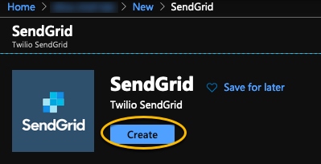
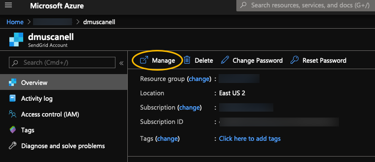
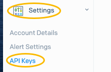
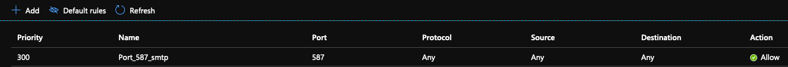
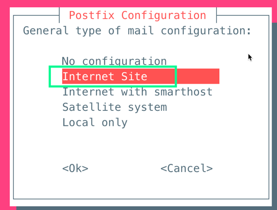
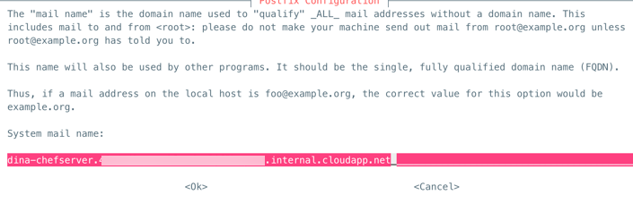
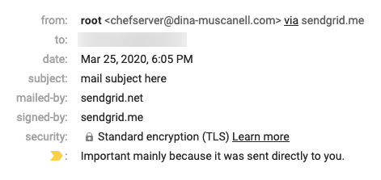
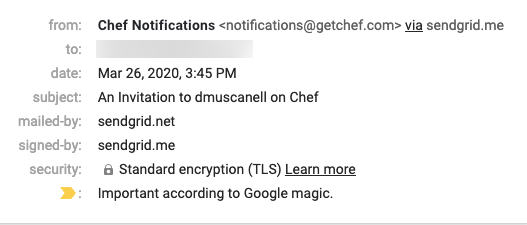

# HowTo - Set up SendGrid in Azure and connect it to a Chef Server to send email notifications

This guide will show how to configure SendGrid (free tier) in Azure as a local mail transfer agent that allows the Chef Server to send email notifications

## Before You Start

**IMPORTANT!**

- **BE WARNED** Chef Manage is deprecated and no longer under active development. It is supported on Chef Automate installations up to version 1.8 and replaced by Chef Automate 2.0.

### Assumptions

- An Ubuntu 18.04 VM is deployed in Azure and configured
- The user can SSH into the Ubuntu machine and run `sudo` commands.
- The user has a general understanding of Network Security Groups in Azure
- The user has completed the rest of the pre-reqs for the chef server listed [here](https://docs.chef.io/install_server/#prerequisites), with the **exception** of:
  - A local mail transfer agent that allows the Chef Infra Server to send email notifications

### Versions Tested

- Chef Server `13.1.13`
- Ubuntu `18.04`
- SendGrid `latest` the SaaS application will be used

## Configuring SendGrid in Azure and connecting it to a Chef Server

------

### In Azure, deploy SendGrid

- For the purpose of this tutorial, the free tier of SendGrid will be selected.  If the organization you are in will require more emails than the free tier supports, please select a paid tier accordingly.

- The free tier will suffice for any personal use.
  - 

- The free pricing tier should be selected by default.  Select the tier that fits your needs and fill in the rest of the information required.
  - The username in Azure only corresponds to the SendGrid website login, it will not be used for any configuration value

- Once the deployment is complete, go to the resource and hit the manage button
  - 

- It should bring you to the SendGrid website.  It may ask you to validate your email.  
- On the left navigation, hit Settings, then API keys
  - 

- On the upper right, hit `Create API Key` and **take note of the key shown**
  - The API key will be used at a later point during the configuration

### Add the SMTP Port to Outbound Networking rules

- For the Network Security Group linked to the Ubuntu box, open port 587 (smtp) for the outbound rules.



### Configure the SMTP server in Ubuntu

- SSH into the Ubuntu server.  Ensure you can run `sudo` commands on the Ubuntu box.
  - `sudo apt-get update`
  - `sudo apt-get install postfix`

- Postfix is the default mail transfer agent in Ubuntu.  
  - In the configuration, Postfix will be setup to use SendGrid as a relay.

- 

- The next screen will ask about the `system mail name`.  **Leave this AS IS**  
  - It can be changed _at a later point and this post will show how to update it_

- 

- Now open `/etc/postfix/main.cf` in your editor of choice.  
  - I prefer `vi` so I ran `vi /etc/postfix/main.cf`

- At the bottom of `main.cf` add the following lines

```bash
# === added for SendGrid Configuration.  Date Changed: <TODAY'S DATE>
smtp_sasl_auth_enable = yes
smtp_sasl_password_maps = hash:/etc/postfix/sasl_passwd
smtp_sasl_security_options = noanonymous
smtp_sasl_tls_security_options = noanonymous
smtp_tls_security_level = encrypt
header_size_limit = 4096000
relayhost = [smtp.sendgrid.net]:587
```

- Next, the file `/etc/postfix/sasl_passwd` doesn't exist yet, so let's create it and get it mapped.
  - `vi /etc/postfix/sasl_passwd`

- In the file `sasl_passwd`, the API key needs to be added _(yes, this file is only one line)_:
  - `[smtp.sendgrid.net]:587 apikey:<YOUR API KEY>`

- Note: we had opened port `587` for SMTP.  A different smtp port can be used such as `22` as well, by default it is `587`

- Now that this sensitive file has been created, lets give the file some permissions and map it
  - `sudo chmod 600 /etc/postfix/sasl_passwd`
  - `sudo postmap /etc/postfix/sasl_passwd`
  - `postmap /etc/postfix/sasl_passwd`

- Install a mail client that allows email to be sent from the Ubuntu box to an email address

- I installed `heirloom-mail`, to install it on Ubuntu 18.04 the `sources.list` file needs to be updated
  - `vi /etc/apt/sources.list`
    - Add the following line:
      - `deb http://security.ubuntu.com/ubuntu trusty-security main universe`
    - Then:
      - `sudo apt-get update`
      - `sudo apt-get install heirloom-mailx`

- In some versions of Ubuntu, supporting libraries may need to be installed.  I found these were already installed in 18.04.  
  - If you need the supporting libraries, run:
    - `sudo apt-get install libsasl2-modules`

- Let's restart the mail service and send a test email.
  - `sudo systemctl restart postfix`

- Ensure the mail service starts by reviewing the log at `cat /var/log/mail.log`

- Once verified the mail service is up, send a test email:
  - `echo "mail body here" | mail -s "mail subject here" <YOUR EMAIL>`

- The email received should look like this:
  - 

- The `from` is super long `dina-server.d45f<very long GUID>3948.internal.cloudapp.net` lets update this.

- Create a file called `/etc/postfix/generic` in the file put (_ensure to replace `myname` and `domain` accordingly_):
  - `root     myname@domain.com`

- Update the `main.cf` to point to the `generic` file:
  - `vi /etc/postfix/main.cf`

- At the bottom of `main.cf` add:
  - `smtp_generic_maps = hash:/etc/postfix/generic`

- Apply the change and once again, restart postfix and verify the service starts.
  - `postmap /etc/postfix/generic`
  - `sudo systemctl restart postfix`
  - `cat /var/log/mail.log`

- Verify the mail service is up, send another test email:
  - `echo "mail body here" | mail -s "mail subject here" <YOUR EMAIL>`

- The email received should look like this (_note the updated from address_):
  - 

- When the Chef Server setup is complete, here is an example of what a user would receive as an invitation to an organization on the Chef Server:
  - 
