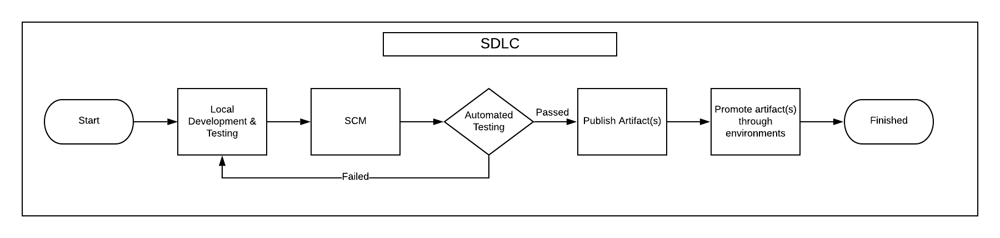
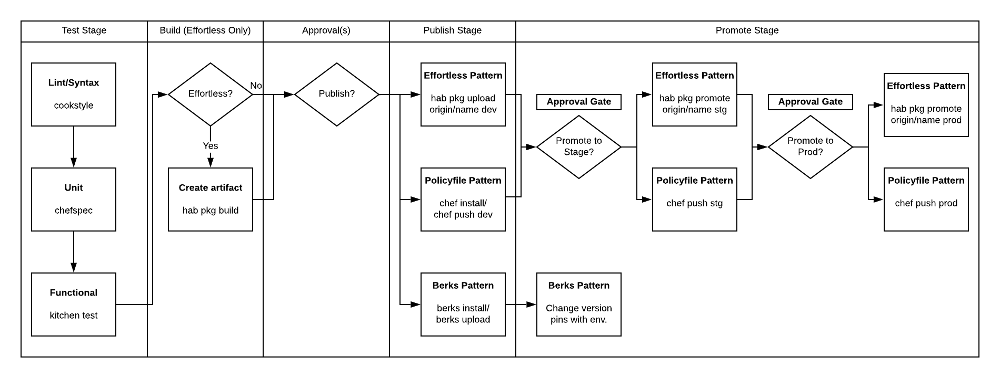
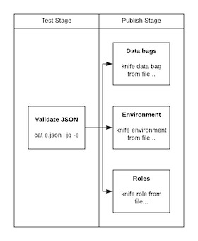
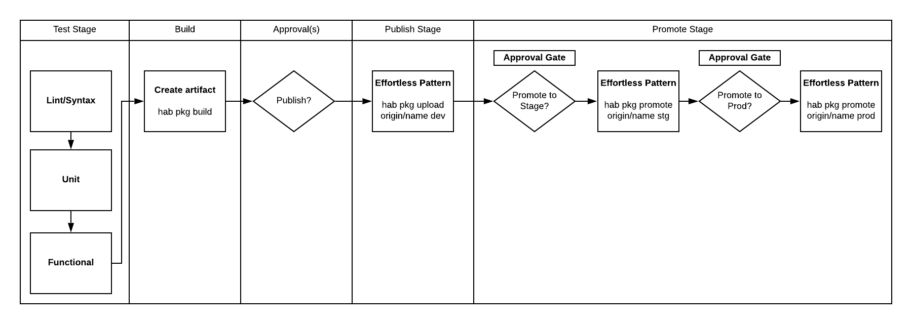
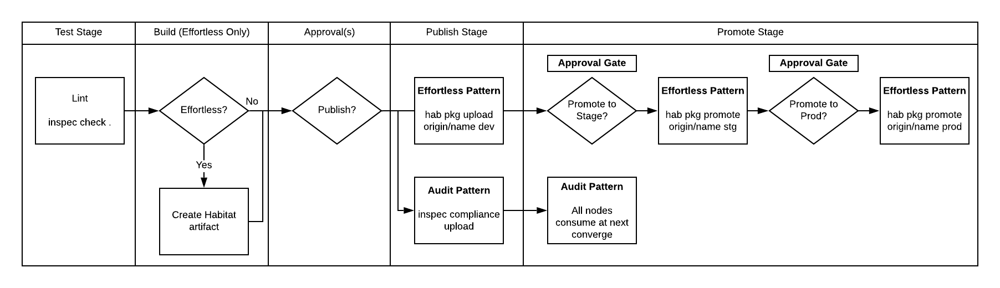

# HowTo - Pipeline examples

This repo contains examples for pipelining Chef related artifacts using several of the popular CI/CD tools. While these examples should be functional and directly consumable, they are not exhaustive and only provide the minimum recommended steps. The author's expectation is that consumers will use these examples to get started then tailor them as needed in a continuous improvement fashion.

## Before You Start

### Assumptions

* This assumes you have the ability to provision/enable the settings and options for your preferred CI/CD tool

### Tested Versions

* Azure DevOps - [dev.azure.com](https://dev.azure.com)
* Jenkins - 2.190.2
* GitLab - [gitlab.com](https://www.gitlab.com)

## Pipeline basics

Before we look at the technical details of the pipelines, let's review some core concepts. Even though we may be deploying configurations or infrastructure, it's all code. Fortunately for us, there's an existing methodology for managing the lifecycle of code know as the Software Development Lifecycle (SDLC). While we could go on for hours discussing SDLC, let's focus on how SDLC applies to Chef artifacts.

The basic idea is Build, Test, Publish, Promote. Let's take a look at each of these items:

* Build - The build phase includes writing the code, writing tests, local testing, and standard Source Code Management (SCM) tasks.
* Test - The test phase is where the tests are run automatically and can include external security, hardening, and/or compliance tests. This step ensures that adequate and required testing takes place and prevents untested/unverified code from being deployed to production.
* Publish - Publishing means that we're putting the artifact somewhere accessible, i.e. uploading to Chef Server or BLDR.
* Promote - The promotion process is where our nodes actually consume the artifact. For some artifacts, this is a controlled process whereas others are all or none. These differences are called out in the respective sections.

Since SDLC is a process, this same flow works for all the artifacts. In the next section, we'll review the minimum steps for each object type. There are links at the end of each section to the tool specific details and instructions.

### Cookbooks

Cookbooks have three variations; the modern effortless pattern, the current policyfile pattern, and the legacy berks pattern. The `Test` stage is the same for all three patterns.

* Lint/Syntax - Verify that the cookbook code is free of errors and follows proper patterns
* Unit - Use Unit tests to verify complex logic in the cookbook. Do not write Unit tests for simple resources.
* Functional - Provision ephemeral instance(s) to test the functionality of the cookbook.

> NOTE: Functional testing can add considerable complexity to the pipeline process depending on the technical variations of the target environment. The general recommendation is to use cloud resources for Kitchen testing as it simplifies the configuration of the CI/CD tool.

All three patterns have similar `Publish` stages as well. The primary difference being the commands executed to complete the publish action.

The `Promote` stage has the widest variance in process as the legacy `berks` pattern is considerably different than the `effortless` and `policyfile` patterns. If you are using the legacy `berks` pattern, scroll on down to the Environments section. Be sure to read the caveats and warnings.

On to the modern patterns. If you think that the `effortless` and `policyfiles` patterns look alike, you aren't seeing double. The workflow is exactly the same. The functional difference between them is mechanism in how `chef-client` is delivered/executed on the target node. The diagram above shows 3 environments: `dev`, `stg`, and `prod`; however, these can be expanded to include additional environments if needed. The examples in this repo use simple approvals. Once a base pipeline is running, one can extend the process to integrate with change management systems or other approval systems.

### Data bags, Environments, and Roles

If the diagram above looks a little sparse, you are correct. There are several legacy objects in the Chef Infra ecosystem that aren't versioned and only have a single stage lifecycle. A change to a data bag, environment, or role will affect any system that consumes that object during the next converge. We still pipeline these artifacts so we can have a single path to production. This also give us better change tracking and auditability as all changes happen in the SCM system.

There is one recommended step, validating the JSON. While there are numerous ways to lint or validate JSON data, `jq` seems to be the simplest as the `-e` option will give discrete exit codes for failures.

### Plans

### Profiles

## FAQs

1. [This section should be updated regularly as people ask about certain behaviors and you answer questions related to this example.]
